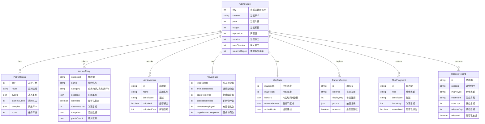

## 1. 架构设计

```mermaid
flowchart TB
    subgraph "前端层"
        "React 18 SPA" --> "Zustand 状态管理"
        "React 18 SPA" --> "React Router v6"
        "React 18 SPA" --> "CSS Modules + Tailwind"
    end
    subgraph "游戏引擎层"
        "Zustand 状态管理" --> "GameStore 游戏核心状态"
        "Zustand 状态管理" --> "SeasonSystem 四季系统"
        "Zustand 状态管理" --> "MapSystem 迷雾地图"
        "Zustand 状态管理" --> "EventSystem 随机事件"
    end
    subgraph "数据层"
        "GameStore 游戏核心状态" --> "localStorage 持久化"
        "GameStore 游戏核心状态" --> "静态数据 (JSON)"
    end
```

## 2. 技术说明
- 前端框架：React@18 + TypeScript
- 样式方案：Tailwind CSS@3 + CSS Modules（自定义动画与特效）
- 构建工具：Vite
- 状态管理：Zustand（轻量、支持持久化中间件）
- 路由：React Router v6（HashRouter，支持纯静态部署）
- 数据持久化：localStorage（通过 zustand/middleware/persist）
- 无后端服务，纯客户端单机游戏
- 粒子效果：纯CSS动画 + requestAnimationFrame

## 3. 路由定义
| 路由 | 用途 |
|------|------|
| / | 游戏主菜单/开始界面 |
| /camp | 营地整备界面 |
| /route | 路线选择/地图探索界面 |
| /patrol | 巡护进行中界面（足迹识别/事件触发） |
| /camera | 红外相机管理界面 |
| /rescue | 伤病救助界面 |
| /poacher | 盗猎线索界面 |
| /negotiate | 村民协商界面 |
| /rating | 年度评级界面 |
| /codex | 动物图鉴界面 |
| /journal | 巡护日志界面 |
| /achievements | 成就收藏界面 |

## 4. 数据模型

### 4.1 核心数据模型定义



### 4.2 核心数据定义

#### 季节系统数据
| 季节 | 天数范围 | 天气池 | 事件倍率 | 动物活跃度 |
|------|----------|--------|----------|------------|
| 春 | 1-30 | 晴40%/阴30%/雨25%/暴风5% | 1.0x | 中 |
| 夏 | 31-60 | 晴50%/阴20%/雨20%/暴风10% | 1.3x | 高 |
| 秋 | 61-90 | 晴35%/阴30%/雨25%/暴风10% | 1.1x | 中高 |
| 冬 | 91-120 | 晴20%/阴25%/雪35%/暴风20% | 0.7x | 低 |

#### 地形类型数据
| 地形 | 移动消耗 | 事件概率 | 可发现资源 | 视觉色 |
|------|----------|----------|------------|--------|
| 密林 | 2体力 | 高 | 足迹/粪便/毛发 | #1a4a1a |
| 山地 | 3体力 | 中 | 陷阱/相机位 | #6b5b3a |
| 溪流 | 2体力 | 中 | 足迹/水源动物 | #3a6a8a |
| 草甸 | 1体力 | 中高 | 足迹/相机位 | #4a7a2a |
| 村落 | 1体力 | 低 | 协商事件 | #8a7a5a |
| 营地 | 0体力 | 无 | 整备/恢复 | #5a4a2a |

#### 装备数据
| 装备 | 价格 | 效果 | 负重 |
|------|------|------|------|
| 望远镜 | 200 | 足迹识别成功率+20% | 1 |
| 急救包 | 150 | 治疗成功率+15% | 1 |
| GPS定位仪 | 300 | 迷雾揭示范围+1 | 1 |
| 采样工具套装 | 250 | 样本采集成功率+25% | 2 |
| 红外相机 | 500 | 可布设红外相机 | 2 |
| 防护服 | 400 | 暴风雪伤害-50% | 2 |
| 铁剪 | 180 | 陷阱拆除成功率+20% | 1 |
| 对讲机 | 350 | 村民协商选项+1 | 1 |

#### 动物物种数据（部分）
| 物种 | 分类 | 足迹特征 | 出现季节 | 活动地形 | 稀有度 |
|------|------|----------|----------|----------|--------|
| 大熊猫 | 哺乳 | 圆形5趾，爪痕明显 | 春夏秋 | 密林/山地 | 稀有 |
| 川金丝猴 | 哺乳 | 细长指痕，拇指分离 | 春夏 | 密林 | 稀有 |
| 小熊猫 | 哺乳 | 小型5趾，爪痕弯曲 | 春夏秋 | 密林/山地 | 较稀有 |
| 羚牛 | 哺乳 | 大型偶蹄，双趾 | 四季 | 山地/草甸 | 较稀有 |
| 红腹锦鸡 | 鸟类 | 三趾前行，细长 | 春夏 | 草甸/密林 | 常见 |
| 大鲵 | 爬行 | 蹼状四趾，拖尾痕 | 春夏 | 溪流 | 较稀有 |

## 5. 项目目录结构

```
src/
├── components/          # 通用组件
│   ├── HexGrid/         # 六边形地图组件
│   ├── SeasonalEffect/  # 季节粒子特效
│   ├── StatusBar/       # 状态栏组件
│   └── Card/            # 通用卡片组件
├── pages/               # 页面组件
│   ├── MainMenu/        # 主菜单
│   ├── Camp/            # 营地整备
│   ├── RouteSelect/     # 路线选择
│   ├── Patrol/          # 巡护进行中
│   ├── Camera/          # 红外相机
│   ├── Rescue/          # 伤病救助
│   ├── Poacher/         # 盗猎线索
│   ├── Negotiate/       # 村民协商
│   ├── Rating/          # 年度评级
│   ├── Codex/           # 动物图鉴
│   ├── Journal/         # 巡护日志
│   └── Achievements/    # 成就收藏
├── stores/              # Zustand 状态
│   ├── gameStore.ts     # 游戏核心状态
│   ├── mapStore.ts      # 地图状态
│   └── uiStore.ts       # UI状态
├── systems/             # 游戏系统逻辑
│   ├── seasonSystem.ts  # 四季轮换
│   ├── weatherSystem.ts # 天气系统
│   ├── eventSystem.ts   # 随机事件
│   ├── combatSystem.ts  # 陷阱拆除
│   └── ratingSystem.ts  # 评分系统
├── data/                # 静态数据
│   ├── animals.ts       # 动物数据
│   ├── equipment.ts     # 装备数据
│   ├── events.ts        # 事件数据
│   ├── terrain.ts       # 地形数据
│   └── achievements.ts  # 成就数据
├── types/               # TypeScript 类型定义
│   └── game.ts          # 游戏类型
├── utils/               # 工具函数
│   ├── hexUtils.ts      # 六边形计算
│   └── random.ts        # 随机数生成
├── App.tsx              # 应用入口
├── main.tsx             # 渲染入口
└── index.css            # 全局样式
```
